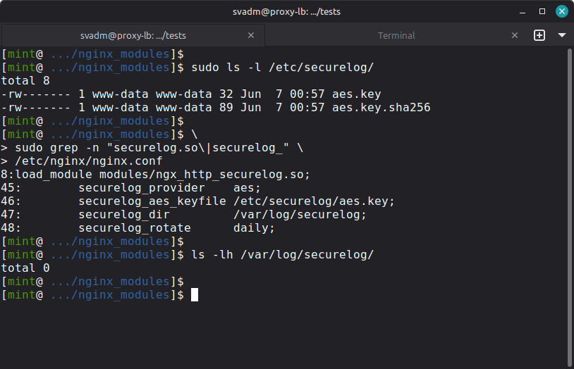
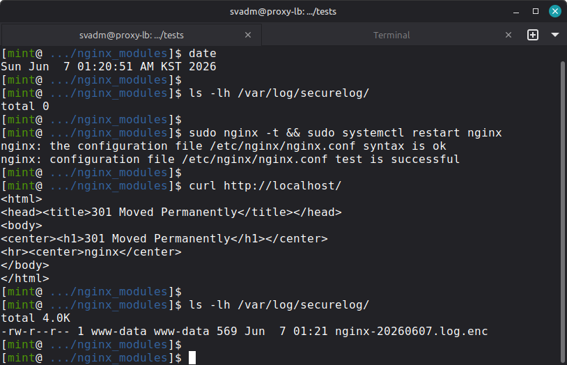
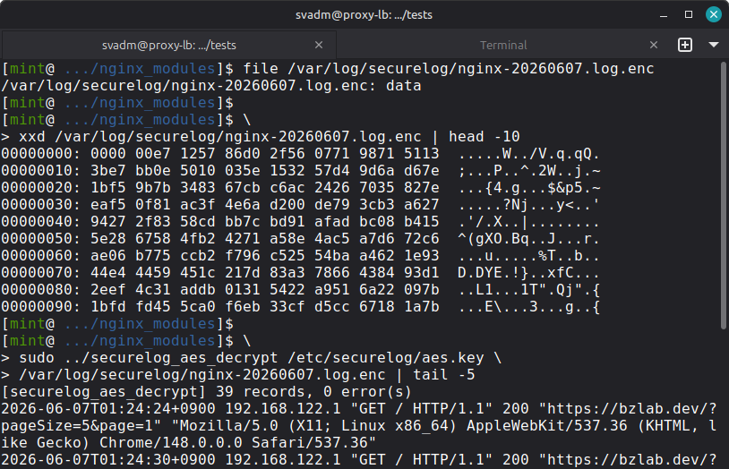
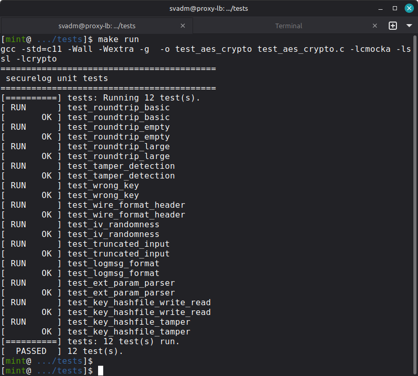

# ngx_http_securelog_module

> **NGINX dynamic module for real-time encrypted HTTP access logging.**  
> Plaintext never touches disk — every log record is encrypted at the moment of writing.

[](https://github.com/no1xpert/ngx_http_securelog_module/actions)
[](LICENSE)
[](https://nginx.org)
[](https://github.com/no1xpert/ngx_http_securelog_module/releases)

---

## Why This Module?

Standard NGINX access logs are stored as **plaintext**. Even with post-processing
scripts or filesystem encryption, plaintext exists on disk for some period of time.

This module eliminates that window entirely:

```
Standard approach
  Request → plaintext log written → (batch) encrypt → encrypted file
                 ↑ plaintext on disk, even briefly

This module
  Request → log phase → encrypt immediately → encrypted file only
                            ↑ plaintext never reaches disk
```

**Regulatory alignment:** GDPR Art.32 · PCI-DSS Req.10 · Korea EFSR Art.15 (FSS) · Korea PIPA Art.29

---

## Features

- Real-time encryption at NGINX log phase (zero plaintext on disk)
- Three provider modes: **AES-256-GCM**, **GPG**, **EXT** (pluggable KMS/HSM)
- **Key integrity verification** at every nginx startup (SHA-256)
- Per-worker log files — no cross-process locking, no data corruption
- Log rotation: `daily` (default) · `hourly` · `size:NM`
- Full log record: ISO-8601 timestamp · IP · method · URI · HTTP version · status · referer · user-agent
- Dynamic module — no NGINX recompilation required
- Verified: NGINX 1.26.3 · Debian 13 (Trixie) · OpenSSL 3.5.5

---

## Provider Summary

| Provider | Key type | Status | Best for |
|----------|----------|--------|----------|
| `aes` | 32-byte AES-256 key file | ✅ Verified | High-traffic servers, symmetric encryption |
| `gpg` | RSA/EC public key | ✅ Verified | Private key never on server, off-server decryption |
| `ext` | Vendor-defined | 🔲 Planned (v2.0) | Enterprise KMS/HSM: D'Amo, PKCS#11, AWS/GCP/Azure KMS |

---

## Verified Environment

| Component | Version |
|-----------|---------|
| OS | Debian 13 (Trixie) amd64 |
| Kernel | Linux 6.12.88+deb13 |
| NGINX | 1.26.3 (APT install + dynamic module) |
| OpenSSL | 3.5.5 |
| GPGME | 1.18.0 |
| GCC | 14.2.0 |
| CMocka | 1.1.7 |

---

## Installation

### 1. Prerequisites

```bash
# Debian / Ubuntu
sudo apt install -y \
    libgpgme-dev libssl-dev \
    libpcre3-dev zlib1g-dev \
    gcc make wget git

# RHEL / Rocky / AlmaLinux
sudo dnf install -y \
    gpgme-devel openssl-devel \
    pcre2-devel zlib-devel \
    gcc make wget git
```

### 2. Verify NGINX compatibility

```bash
nginx -V 2>&1 | grep -- '--with-compat'
```

Must contain `--with-compat`. Debian/Ubuntu APT-installed NGINX always includes this.

```bash
# Check installed version
nginx -v
# nginx version: nginx/1.26.3
```

### 3. Download matching NGINX source

```bash
NGINX_VER=$(nginx -v 2>&1 | grep -o '[0-9.]*$')
wget https://nginx.org/download/nginx-${NGINX_VER}.tar.gz
tar zxf nginx-${NGINX_VER}.tar.gz
```

### 4. Clone this module

```bash
git clone https://github.com/no1xpert/ngx_http_securelog_module.git
```

### 5. Build dynamic module

```bash
cd nginx-${NGINX_VER}
./configure \
    --with-compat \
    --add-dynamic-module=../ngx_http_securelog_module
make modules
```

Expected (warnings-free):
```
+ ngx_http_securelog was configured
...
cc -o objs/ngx_http_securelog.so ... -lgpgme -lcrypto -ldl -shared
```

### 6. Install module

```bash
# Create modules directory if it does not exist (Debian minimal install)
sudo mkdir -p /usr/lib/nginx/modules

# Copy the module
sudo cp objs/ngx_http_securelog.so /usr/lib/nginx/modules/

# Note for Debian: nginx may look for modules at /usr/share/nginx/modules/
# If nginx -t reports module not found, create a symlink:
sudo ln -sf /usr/lib/nginx/modules /usr/share/nginx/modules
```

> **Debian minimal install note:**  
> A minimal Debian NGINX installation may not include the `modules` directory.  
> Run `sudo mkdir -p /usr/lib/nginx/modules` before copying the `.so` file.  
> If `nginx -t` still reports the module as not found, the symlink above resolves it.

---

## Configuration

### AES-256-GCM (recommended)

**Step 1 — Generate key and hash file**

```bash
sudo mkdir -p /etc/securelog /var/log/securelog
sudo bash tools/securelog_keygen.sh /etc/securelog/aes.key
sudo chown www-data:www-data /etc/securelog/aes.key \
                              /etc/securelog/aes.key.sha256 \
                              /var/log/securelog
sudo chmod 600 /etc/securelog/aes.key /etc/securelog/aes.key.sha256
```

This creates two files:
```
/etc/securelog/aes.key        — 32-byte AES-256 key (binary)
/etc/securelog/aes.key.sha256 — SHA-256 hash for integrity check
```

**Step 2 — nginx.conf**

```nginx
# Top of nginx.conf (before events {})
load_module modules/ngx_http_securelog.so;

http {
    securelog_provider    aes;
    securelog_aes_keyfile /etc/securelog/aes.key;
    securelog_dir         /var/log/securelog;
    securelog_rotate      daily;

    # ... rest of your existing config
}
```

**Step 3 — Validate and reload**

```bash
sudo nginx -t
# nginx: configuration file /etc/nginx/nginx.conf syntax is ok
# nginx: configuration file /etc/nginx/nginx.conf test is successful

sudo systemctl reload nginx
```

Check error.log to confirm key integrity verification passed:
```bash
sudo grep securelog /var/log/nginx/error.log
# [notice] securelog/aes: key integrity verified OK (SHA-256 match)
# [notice] securelog/aes: AES-256-GCM provider initialized
```

**Step 4 — Generate traffic and decrypt**

```bash
# Generate some requests
curl http://localhost/
curl http://localhost/test

# Verify encrypted file exists
ls -lh /var/log/securelog/
# -rw-r--r-- 1 www-data www-data 462 Jun  6 nginx-20260606.log.enc

# Confirm it is binary (not plaintext)
xxd /var/log/securelog/nginx-$(date +%Y%m%d).log.enc | head -5

# Build decryption tool
gcc -O2 -o securelog_aes_decrypt \
    tools/securelog_aes_decrypt.c -lcrypto

# Decrypt
sudo ./securelog_aes_decrypt \
    /etc/securelog/aes.key \
    /var/log/securelog/nginx-$(date +%Y%m%d).log.enc
```

Example decrypted output:
```
2026-06-06T20:10:04+0900 192.168.1.1 "GET / HTTP/1.1" 200 "https://example.com/" "Mozilla/5.0 ..."
2026-06-06T20:10:05+0900 ::1 "GET /test HTTP/1.1" 301 "" "curl/8.14.1"
```

---

### GPG (asymmetric — private key never on server)

```bash
# Export recipient public key
gpg --export --armor your@email.com > /etc/securelog/recipient.pub
```

```nginx
load_module modules/ngx_http_securelog.so;

http {
    securelog_provider    gpg;
    securelog_gpg_pubkey  /etc/securelog/recipient.pub;
    securelog_gpg_keyid   ABCD1234ABCD1234ABCD1234ABCD1234ABCD1234;
    securelog_dir         /var/log/securelog;
    securelog_rotate      daily;
}
```

```bash
# Decrypt on the machine holding the private key
gpg --decrypt /var/log/securelog/nginx-20260606.log.enc
```

---

### EXT provider — D'Amo / HSM / cloud KMS *(Next Phase — v2.0)*

> ⚠ **Status: Interface defined, not yet tested.**  
> The EXT provider contract is available as a template but integration with
> actual vendor SDKs (D'Amo, PKCS#11 HSM, AWS/GCP/Azure KMS) is planned for **v2.0**.  
> See [`tools/securelog_ext_provider_template.c`](tools/securelog_ext_provider_template.c)
> for the full provider contract and SDK integration notes (D'Amo, PKCS#11).

```nginx
# v2.0 planned configuration (not yet production-ready)
load_module modules/ngx_http_securelog.so;

http {
    securelog_provider    ext;
    securelog_ext_library /etc/nginx/modules/securelog_damo_provider.so;
    securelog_ext_param   "key_id=PROD_LOG_KEY;server=kms.internal:7443";
    securelog_dir         /var/log/securelog;
    securelog_rotate      hourly;
}
```

**Provider contract** — the `.so` must export these three symbols:

```c
// Called once per worker at startup. Return 0 = OK, non-zero = abort.
int securelog_provider_init(const char *param, ngx_log_t *log);

// Called for every log record. Allocate *out with malloc(); caller frees.
int securelog_provider_encrypt(
    const unsigned char *in,  size_t  in_len,
    unsigned char      **out, size_t *out_len,
    ngx_log_t          *log);

// Called once per worker at shutdown. May be NULL in the .so.
void securelog_provider_cleanup(void);
```

---

## Key Integrity Verification

Every time nginx starts or reloads, the module verifies the AES key has not been
tampered with:

```
nginx reload
  └─ worker init
       └─ open aes.key → compute SHA-256
            ├─ compare with aes.key.sha256
            ├─ MATCH    → [notice] key integrity verified OK
            ├─ MISMATCH → [emerg]  KEY INTEGRITY CHECK FAILED → worker aborted
            └─ .sha256 absent → [warn] skipping verification (backward compat)
```

To verify manually at any time:
```bash
sha256sum --check /etc/securelog/aes.key.sha256
# /etc/securelog/aes.key: OK
```

---

## Log Rotation

| Value | File naming | New file trigger |
|-------|-------------|-----------------|
| `daily` (default) | `nginx-YYYYMMDD.log.enc` | Midnight |
| `hourly` | `nginx-YYYYMMDD-HH.log.enc` | Every hour |
| `size:64M` | `nginx-YYYYMMDD-HHMMSS.log.enc` | File reaches 64 MiB |

Suffixes: `K` (KiB), `M` (MiB), `G` (GiB). Example: `size:512M`.

---

## Directives Reference

| Directive | Context | Default | Description |
|-----------|---------|---------|-------------|
| `securelog_provider` | `http` | — | **Required.** `aes` \| `gpg` \| `ext` |
| `securelog_aes_keyfile` | `http` | — | Path to 32-byte AES-256 key file (AES provider) |
| `securelog_gpg_pubkey` | `http` | — | Path to GPG public key file (GPG provider) |
| `securelog_gpg_keyid` | `http` | first key | GPG fingerprint or key ID (GPG provider) |
| `securelog_ext_library` | `http` | — | Path to provider `.so` (EXT provider) |
| `securelog_ext_param` | `http` | `""` | Opaque string passed to provider `init()` |
| `securelog_dir` | `http` | `/var/log/securelog` | Encrypted log output directory |
| `securelog_rotate` | `http` | `daily` | `daily` \| `hourly` \| `size:NM` |

---

## AES Wire Format

Each record in the binary `.log.enc` file:

```
+------------------------------------------------------------+
| 4 bytes   | Record length N (big-endian uint32)            |
| 12 bytes  | IV / nonce  (CSPRNG random, unique per record) |
| 16 bytes  | GCM authentication tag (tamper detection)      |
| N-28 bytes| Ciphertext                                     |
+------------------------------------------------------------+
```

The GCM tag provides **authenticated encryption** — any bit flip in the
ciphertext or IV is detected and rejected on decryption.

---

## Unit Tests

```bash
sudo apt install -y libcmocka-dev
cd tests && make run
```

```
[==========] Running 12 test(s).
[ RUN      ] test_roundtrip_basic          [  OK  ]
[ RUN      ] test_roundtrip_empty          [  OK  ]
[ RUN      ] test_roundtrip_large          [  OK  ]
[ RUN      ] test_tamper_detection         [  OK  ]
[ RUN      ] test_wrong_key                [  OK  ]
[ RUN      ] test_wire_format_header       [  OK  ]
[ RUN      ] test_iv_randomness            [  OK  ]
[ RUN      ] test_truncated_input          [  OK  ]
[ RUN      ] test_logmsg_format            [  OK  ]
[ RUN      ] test_ext_param_parser         [  OK  ]
[ RUN      ] test_key_hashfile_write_read  [  OK  ]
[ RUN      ] test_key_hashfile_tamper      [  OK  ]
[  PASSED  ] 12 test(s).
```

---

## Security Notes

| Topic | Detail |
|-------|--------|
| AES key file | `chmod 600`, owned by nginx worker user. Consider secrets manager injection |
| Hash file | `chmod 600`, same owner. Back up separately from key |
| GPG private key | Never required on web server — only public key needed |
| EXT provider | `.so` runs inside worker process; audit vendor SDK thread-safety |
| Key backup | Store key + hash file in a separate secure location (offline or HSM) |

---

## Roadmap

| Version | Status | Highlights |
|---------|--------|------------|
| **v0.9.0-beta** | ✅ Released | AES-256-GCM · GPG · EXT interface · key integrity · 12 unit tests |
| v1.1 | Planned | **Error log encryption** · env-var KMS · `.deb`/`.rpm` packages · integration tests |
| v2.0 | Planned | KMS Adapter Layer · Vault/AWS/GCP/Azure KMS · envelope encryption · key rotation · **EXT provider implementations** |
| v2.1 | Commercial | D'Amo KMS Adapter · PKCS#11 HSM Adapter · enterprise dashboard |

### v1.1 — Error Log Encryption (planned)

In addition to access logs, nginx error logs will also be encrypted
using the same provider (AES-256-GCM / GPG / EXT).
Each log type can be independently enabled or disabled via directive:

```nginx
# v1.1 planned configuration
securelog_provider      aes;
securelog_aes_keyfile   /etc/securelog/aes.key;
securelog_dir           /var/log/securelog;

securelog_access_log    on;   # encrypt access log (default: on)
securelog_error_log     on;   # encrypt error log  (default: off, new in v1.1)
```

Encrypted output files:
```
/var/log/securelog/nginx-YYYYMMDD.log.enc        # access log
/var/log/securelog/nginx-YYYYMMDD.error.log.enc  # error log (v1.1)
```

---

## Enterprise / Commercial

For production deployments requiring SLA, D'Amo/HSM/cloud KMS integration,
compliance consulting (GDPR, Korea EFSR/FSS, Korea PIPA), or annual support contracts:

→ **no1xpert@bzlab.dev** · [bzlab.dev](https://bzlab.dev)

---

## Author

**Bongshin Choi** · [bzlab.dev](https://bzlab.dev)

## License

[BSD 2-Clause](LICENSE) — free for personal and commercial use.  
Commercial licensing available for enterprise use cases.

---

## Verification Screenshots

| Step | Screenshot |
|------|------------|
| Key generation + nginx.conf |  |
| nginx -t + log file created |  |
| Encrypted binary + decryption |  |
| Unit tests 12 PASSED |  |
